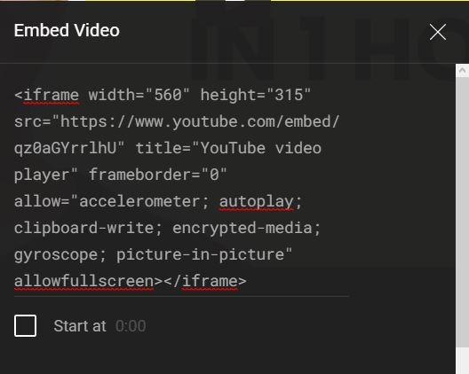
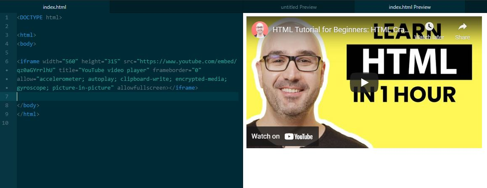

# How to Put a YouTube video on your html webpage
## by Jonathan Azcona
This markdown is using Dillinger which is a cloud-enabled, mobile-ready, offline-storage compatible, AngularJS-powered HTML5 Markdown editor.

Today, I am writing about how to include a Youtube video into your html page.

## Steps
## 1) Finding the video code
- In this step, you will find the video you want to attach to your webpage and finding the embedded code attached to the video
- Find the "share" button right next to the likes and dislikes of the video and click on it.
- Once it opens, click the "Embed" button which looks like "<>"

## 2) Putting it into your webapge
 - Once you find the iframe embedded code provided by YouTube, you can copy and paste that code into your html webpage
    - Example
        <!DOCTYPE html>
<html>
<body>
<iframe widtht="420" height="345" src="..."</iframe>
</body>
</html>

## 3) Save and Reload your webpage
- Once it is done and pasted, reload your webpage and it should be there ready to play.
- Enjoy the video

## Notes
- you can mess around with the width, height and a variety of style and formats like in HTML
- the "src='..' " is replaced with the link to the YouTube Video
    - Ex: <iframe width="156" height="542" src="https://www.youtube.com/watch?v=qz0aGYrrlhU" ...</iframe>
    

